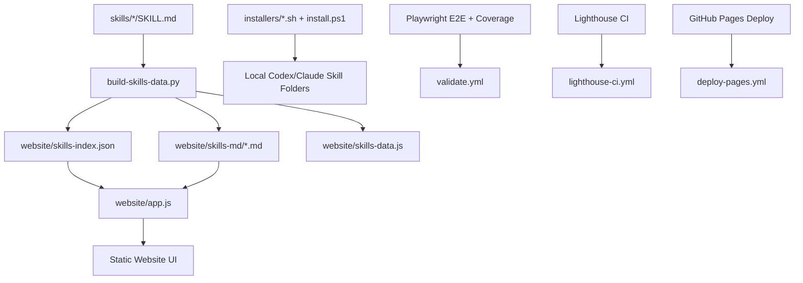

# lighthouse-skill-pack System Design Review (English)

## 1. Executive Summary

`lighthouse-skill-pack` is a static-first repository for distributing reusable Lighthouse optimization skills across Codex and Claude Code. The system intentionally avoids backend services and runtime build complexity, favoring deterministic artifacts, cross-platform installers, and CI-enforced quality gates.

Current architecture is suitable for open-source distribution and low-maintenance operation. The main design strengths are:

- Very low operational footprint (no backend, no DB, no cloud runtime dependency)
- Reproducible generated artifacts for website consumption
- Security-conscious installer scripts with path sanitization
- CI gates for E2E behavior and Lighthouse quality

## 2. Scope, Goals, and Non-Goals

### Goals

- Publish stack-specific `SKILL.md` assets for Lighthouse workflows
- Make skills easy to browse/copy/download through a static website
- Support local installation into Codex/Claude skill directories
- Keep repository understandable and maintainable for external contributors

### Non-Goals

- No authentication, multi-tenant user management, or server-side personalization
- No backend analytics pipeline or telemetry ingestion
- No dynamic CMS/editor interface

## 3. High-Level Architecture



## 4. Runtime and Build Flow

### Authoring Flow

1. Maintain source-of-truth skill docs under `skills/<name>/SKILL.md`
2. Run `python3 website/scripts/build-skills-data.py`
3. Generated outputs:
   - `website/skills-index.json` (metadata consumed by UI)
   - `website/skills-md/*.md` (static markdown payloads)
   - `website/skills-data.js` (legacy/browser-compatible data artifact)

### Website Runtime Flow

1. `app.js` fetches `skills-index.json`
2. UI renders cards from metadata
3. On skill selection, app fetches only `skills-md/<skill>.md`
4. Content is cached in-memory (`Map`) for repeat operations

### CI Flow

- `validate.yml`: syntax checks, generation sync, Playwright E2E + coverage threshold
- `lighthouse-ci.yml`: Lighthouse assertions + failure artifacts (`.lighthouseci/`)
- `deploy-pages.yml`: static site deployment to GitHub Pages

## 5. Data Model and Data Structure Decisions

## 5.1 Skill Metadata Container

### Current choice

- **Structure**: JSON array of objects
- Example shape:

```json
[
  {
    "name": "lighthouse-core",
    "description": "...",
    "path": "skills-md/lighthouse-core.md"
  }
]
```

### Why this structure

- Ordered output for predictable UI ordering
- Simplicity and compatibility with static hosting
- Human-diffable and review-friendly in PRs

### Alternatives

1. Object map keyed by skill name:
   - Pros: O(1) direct lookup
   - Cons: order not intrinsic, less friendly for deterministic rendering by insertion
2. SQLite/embedded DB:
   - Pros: query flexibility
   - Cons: unnecessary operational complexity for static site
3. Full-text index (Lunr/FlexSearch):
   - Pros: faster large-scale search
   - Cons: extra payload/build complexity; not needed at current size

## 5.2 Markdown Content Loading

### Current choice

- Lazy per-skill fetch from `skills-md/*.md`
- In-memory cache using `Map<string, string>`

### Why this structure

- Reduces startup parse/execute cost (helps Lighthouse TBT)
- Keeps UI responsive while preserving functionality
- `Map` provides clean semantic key-value caching

### Alternatives

1. Embed all markdown in one JS/JSON file:
   - Pros: one network request
   - Cons: high startup parse cost and larger blocking payload
2. Use `localStorage` persistent cache:
   - Pros: faster revisit loads
   - Cons: cache invalidation/versioning complexity
3. Service Worker cache:
   - Pros: offline + repeat performance
   - Cons: higher implementation complexity and debugging overhead

## 5.3 Filtered Skill View

### Current choice

- `allSkills` and `filtered` arrays + active name pointer (`activeName`)

### Why this structure

- Straightforward filtering and rendering
- Easy to reason about state transitions
- Minimal code overhead in vanilla JS

### Alternatives

1. Immutable state reducer/store pattern:
   - Pros: strict state transition tracking
   - Cons: unnecessary abstraction for current scale
2. Framework state management (React/Vue):
   - Pros: richer ecosystem
   - Cons: adds dependency and build complexity; conflicts with static-minimal goal

## 5.4 Installer Input Validation

### Current choice

- Regex allowlist (`^[A-Za-z0-9._-]+$`)
- Canonical path boundary checks before delete/copy

### Why this structure

- Prevents traversal/path-injection vectors
- Low-overhead security control in shell and PowerShell

### Alternatives

1. Hardcoded skill allowlist:
   - Pros: strongest strictness
   - Cons: requires script edits for each new skill
2. Prompt-approval per operation:
   - Pros: safer interactive mode
   - Cons: less automation-friendly for CI/scripts

## 6. Architecture Tradeoffs

## 6.1 Static-Only Distribution

- Benefit: zero backend runtime and very low cost
- Tradeoff: limited dynamic features (no user accounts, no server-side analytics)

## 6.2 Vanilla JS + No Build Step

- Benefit: transparent debugging and easy GitHub Pages hosting
- Tradeoff: less ergonomic component composition than framework-based UI

## 6.3 Generated Artifacts Kept in Repo

- Benefit: deterministic deploys and simpler static hosting
- Tradeoff: potential drift if generator is not run (mitigated by CI diff checks)

## 6.4 Strict CI Quality Gates

- Benefit: catches regressions before publish
- Tradeoff: occasional flakiness in synthetic Lighthouse environments; mitigated by failure artifact uploads and hardened flags

## 7. Risks and Mitigations

1. Lighthouse variance in CI
- Mitigation: hardened Chrome flags, failure artifact upload, focused assertions

2. Generated file drift
- Mitigation: `validate.yml` checks generated diffs (`skills-data.js`, `skills-index.json`, `skills-md/`)

3. Growth in skills count causing UI scaling issues
- Mitigation: keep lazy loading, add pagination/indexing when skill count grows significantly

## 8. What to Keep / What to Improve

### Keep

- Static architecture
- Lazy markdown loading
- Security checks in installers
- CI split by responsibility (validate/lighthouse/deploy)

### Improve next (optional)

1. Add schema validation for skill frontmatter during generation
2. Add version field in `skills-index.json` for cache busting/version-aware clients
3. Add artifact upload for Playwright failures in CI (parallel to Lighthouse artifacts)
4. Add deterministic sort policy documentation (e.g., alphabetical by name)

## 9. Deep-Dive Question Prep (with concise answer direction)

1. **Why no backend API?**
- Because distribution/browsing requirements are static and deterministic; backend adds cost and operational risk with no functional gain at current scope.

2. **Why array over map for skills index?**
- UI is list-first and order-sensitive; array is diff-friendly and simple. If direct random access dominates later, add a derived map in-memory.

3. **Why keep `skills-data.js` if `skills-index.json` exists?**
- Compatibility with earlier UI/runtime and potential fallback paths. It can be deprecated in a controlled cleanup.

4. **How is installer safety enforced?**
- Input regex allowlist + canonical path boundary checks before destructive operations.

5. **How do you prevent generated artifact drift?**
- CI regenerates and fails if tracked outputs differ.

6. **Why lazy-load markdown files?**
- Reduces startup payload parsing, improves Lighthouse stability (especially TBT), and scales better with additional skills.

7. **How would you scale to 500+ skills?**
- Keep lazy loading, add client-side index (or prebuilt search index), pagination/virtualization, and optional section taxonomy.

8. **How do you handle Lighthouse CI flakiness?**
- Harden Chrome flags, avoid brittle assertions, upload `.lighthouseci` artifacts on failure for forensic debugging.

9. **What is the rollback strategy?**
- Static assets + GitHub Actions enable simple revert by commit and redeploy with no data migration.

10. **What would justify migrating to a framework?**
- Significant growth in interactive complexity (advanced filtering, user prefs, live editing) that outweighs current simplicity benefits.

## 10. Final Assessment

Architecture is production-suitable for an open-source skill-pack product with minimal operational burden. Current design choices are coherent with project constraints (static deploy, low dependencies, deterministic outputs). The most important long-term discipline is preserving generation determinism and CI reliability as the skill catalog grows.
