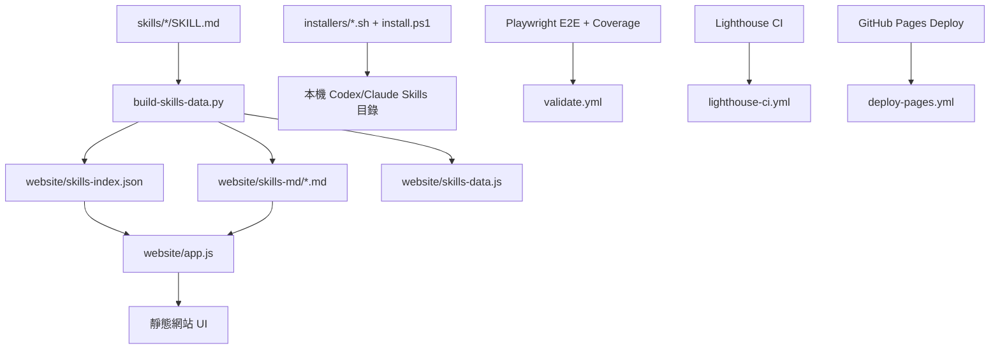

# lighthouse-skill-pack 系統設計審查（繁體中文）

## 1. 執行摘要

`lighthouse-skill-pack` 是一個以「靜態優先」為核心的技能發佈專案，目標是把可重用的 Lighthouse 優化技能提供給 Codex 與 Claude Code。整體架構刻意避免後端服務與複雜建置流程，優先採用可重現產物、跨平台安裝腳本，以及 CI 品質門檻。

目前架構適合開源發佈與低維運成本情境，主要優點：

- 幾乎零營運負擔（無後端、無資料庫、無雲端執行依賴）
- 生成產物可重現，網站消費路徑清晰
- 安裝器具備路徑安全檢查
- 透過 CI 控制 E2E 與 Lighthouse 品質

## 2. 範圍、目標與非目標

### 目標

- 發佈 stack-specific `SKILL.md`（依技術棧）
- 提供靜態網站讓使用者可瀏覽/複製/下載技能
- 支援本機安裝到 Codex/Claude skill 目錄
- 對外部貢獻者保持易懂、可維護

### 非目標

- 不提供登入、權限、多租戶
- 不做後端分析管線或遙測收集
- 不提供動態 CMS 或線上編輯器

## 3. 高階架構



## 4. 執行流程

### 內容產生流程

1. 維護來源檔：`skills/<name>/SKILL.md`
2. 執行 `python3 website/scripts/build-skills-data.py`
3. 產生：
   - `website/skills-index.json`（UI metadata）
   - `website/skills-md/*.md`（靜態 markdown 內容）
   - `website/skills-data.js`（相容/備援資料產物）

### 網站執行流程

1. `app.js` 先載入 `skills-index.json`
2. 以 metadata 渲染卡片
3. 使用者選技能時，再動態抓取對應 `skills-md/<skill>.md`
4. 內容用 `Map` 快取，避免重複抓取

### CI 流程

- `validate.yml`：語法檢查、生成檔一致性、Playwright E2E + coverage 門檻
- `lighthouse-ci.yml`：Lighthouse 指標斷言與失敗時 artifact 上傳
- `deploy-pages.yml`：發佈 `website/` 到 GitHub Pages

## 5. 資料模型與資料結構選型

## 5.1 技能索引容器

### 現行做法

- **結構**：JSON 陣列（array of objects）
- 範例：

```json
[
  {
    "name": "lighthouse-core",
    "description": "...",
    "path": "skills-md/lighthouse-core.md"
  }
]
```

### 為何這樣選

- 順序可控、方便 UI 穩定顯示
- 靜態託管相容性高
- PR diff 易讀

### 替代方案

1. 以 skill name 為 key 的 object map
   - 優點：O(1) 取值
   - 缺點：順序非內建，需要額外排序
2. SQLite / 嵌入式資料庫
   - 優點：查詢彈性高
   - 缺點：對靜態網站是過度設計
3. Full-text index（Lunr/FlexSearch）
   - 優點：大型資料下搜尋快
   - 缺點：額外 payload 與建置複雜度

## 5.2 Markdown 載入策略

### 現行做法

- 每個 skill markdown 延遲載入（lazy fetch）
- `Map<string, string>` 做記憶體快取

### 為何這樣選

- 降低首次載入解析成本（改善 TBT 風險）
- 保留功能但提升性能穩定性
- `Map` 語義清楚、實作簡潔

### 替代方案

1. 全部 markdown 打包進單一 JS/JSON
   - 優點：請求數少
   - 缺點：啟動解析成本高、阻塞風險高
2. `localStorage` 持久快取
   - 優點：重訪更快
   - 缺點：失效策略與版本管理更複雜
3. Service Worker 快取
   - 優點：可離線 + 重訪效能
   - 缺點：實作與除錯成本明顯提升

## 5.3 篩選與 UI 狀態

### 現行做法

- `allSkills`、`filtered` 兩個陣列
- `activeName` 保存當前選取

### 為何這樣選

- 狀態轉換直觀
- Vanilla JS 下維護成本低
- 對目前規模足夠

### 替代方案

1. Immutable reducer/store
   - 優點：狀態轉換可追蹤
   - 缺點：對目前需求屬過度抽象
2. 導入前端框架狀態管理
   - 優點：生態與元件化更完整
   - 缺點：增加依賴與建置複雜度

## 5.4 安裝器安全資料結構

### 現行做法

- 技能名 regex allowlist：`^[A-Za-z0-9._-]+$`
- canonical path 邊界檢查後才刪除/複製

### 為何這樣選

- 防止 traversal / path injection
- 跨 shell 與 PowerShell 都可低成本實作

### 替代方案

1. 硬編碼白名單技能清單
   - 優點：最嚴格
   - 缺點：每新增技能都要改腳本
2. 每次操作互動式確認
   - 優點：更保守
   - 缺點：自動化不友善

## 6. 架構取捨（Tradeoffs）

## 6.1 完全靜態發佈

- 優點：成本低、維運簡單
- 代價：動態功能受限（無帳號、無後端 API）

## 6.2 Vanilla JS + 無建置步驟

- 優點：可讀性與除錯透明、適合 GitHub Pages
- 代價：複雜互動擴展時，元件化能力不如框架

## 6.3 生成檔納入版本庫

- 優點：部署可重現、無需伺服器動態生成
- 代價：若未重生產物可能漂移（以 CI diff 防護）

## 6.4 嚴格 CI 門檻

- 優點：降低發佈回歸風險
- 代價：Lighthouse 合成環境偶有波動；需配套 debug artifact

## 7. 風險與緩解

1. Lighthouse CI 偶發不穩
- 緩解：強化 Chrome flags、失敗 artifact 上傳、避免脆弱斷言

2. 生成檔與來源不同步
- 緩解：`validate.yml` 比對 `skills-data.js`、`skills-index.json`、`skills-md/`

3. 技能數量成長導致 UI 壓力
- 緩解：保留 lazy loading，必要時加分頁/索引

## 8. 建議：保留與下一步

### 建議保留

- 靜態優先架構
- markdown 延遲載入
- 安裝器路徑安全檢查
- CI 分工（validate / lighthouse / deploy）

### 可選優化

1. 生成時增加 frontmatter schema 驗證
2. `skills-index.json` 增加版本欄位做快取失效
3. Playwright 失敗時也上傳 artifact（與 Lighthouse 對齊）
4. 明文化排序策略（例如按名稱字母排序）

## 9. 深入追問準備（Q&A）

1. **為什麼不用後端 API？**
- 需求本質是靜態分發與瀏覽，後端成本高且收益低。

2. **為什麼用陣列不用 map？**
- UI 以清單展示為主且重視穩定排序；若未來隨機查詢佔比高，可在 runtime 衍生 map。

3. **為什麼還保留 `skills-data.js`？**
- 為相容與回退路徑；可在後續版本逐步淘汰。

4. **安裝器如何防止路徑攻擊？**
- regex allowlist + canonical path boundary 檢查後才進行刪除/複製。

5. **如何避免生成檔漂移？**
- CI 會重生並檢查差異，若不一致即 fail。

6. **為什麼改成 markdown lazy loading？**
- 降低初始 parse/exec 成本，提升 Lighthouse 穩定性與可擴展性。

7. **未來 500+ skills 如何擴展？**
- 保留 lazy loading、加入索引/分頁/虛擬列表，必要時導入搜尋索引檔。

8. **Lighthouse CI 不穩怎麼辦？**
- 使用穩定 Chrome flags、保守斷言策略、失敗時上傳 `.lighthouseci` artifact 做鑑識。

9. **回滾策略是什麼？**
- 純靜態產物可直接以 commit 回滾後再部署，不需資料遷移。

10. **何時該導入前端框架？**
- 當互動與狀態複雜度顯著上升，且框架收益大於目前簡潔性時。

## 10. 結論

以目前產品目標（開源分發、低成本維運、可重現品質門檻）來看，現有架構是合理且可上線的。後續重點是持續維持生成流程可重現性與 CI 穩定性，並在技能數量成長時漸進擴展搜尋與瀏覽能力。
